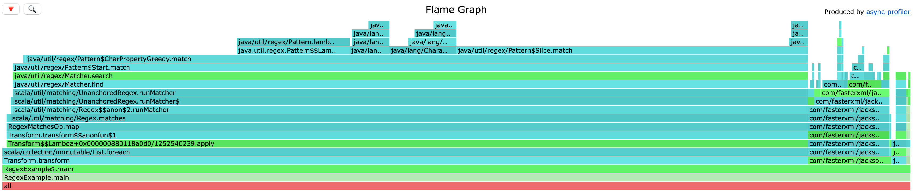

When we created Upsolver, our goal was to build a high-performance, headless big data ELT tool. To achieve this, we deliberately chose a monolithic architecture—and we're not ashamed of it. While monoliths come with trade-offs, they gave us the performance and control we needed early on.

One challenge, though, was debugging performance issues. In a monolithic system, a performance regression isn’t usually tied to a single recent code change—it could be buried within thousands of lines modified over weeks. Unlike microservices, where isolated services simplify blame assignment and performance debugging, our architecture required more robust tooling to understand what was happening inside the JVM in production.

Upsolver is a low-code SQL engine that lets users create pipelines to move data from source to destination, supporting transformations, joins, aggregations, and more. Since we deploy Upsolver into customer-managed environments, we often don’t have access to the actual machines or data.

So when a customer reported, "This job seems slow", we took it seriously. We started with metrics. If the metrics revealed a bottleneck, we fixed it. But if they didn’t, we needed a way to profile production workloads remotely—without affecting customer environments.

That’s where Async Profiler came in.

## What JFR and Async Profiler Bring to the Table
Java Flight Recorder (JFR) is a tool for collecting diagnostic and profiling data about a running JVM application. The data can be visualized as flame graphs that show CPU usage, memory allocations, or lock contention.

Flame graphs are built from stack traces, where the width of each bar indicates how much time or resources a particular function consumed. They’re an intuitive way to spot hotspots in your code.

Async Profiler is a low-overhead, sampling-based profiler that can generate JFR files. It’s particularly well-suited to production environments, and supports CPU, memory, lock, and itimer profiling.

## How We Made It Easy to Profile Applications

### Triggering a JFR dump

The first thing you need is a mechanism to trigger a JFR dump. This could be as simple as an HTTP call—if you have direct access to the server.

Unfortunately, we didn’t have that privilege, since the server resided in the customer’s cloud. What we did have was a “Runtime Configuration” that polled an S3 file in our environment. Originally, we used it to tweak performance-related settings in edge cases. We leveraged the same mechanism to trigger a dump—running Async Profiler and then copying the output to an S3 bucket with a known path format:


```bash
s3://thread-dumps/yyyy/MM/dd/HH/mm/millisecond-<cluster-id>-<instance-name>.jfr
```

### Pulling JFRs

Copying the JFR locally would be an easy operation if you have access to the bucket:

```bash
aws s3 sync s3://thread-dumps/yyyy/MM/dd /tmp/dumps/ --exclude '*' --include '<cluster_id>'
```

### Opening JFRs

Opening the JFR to flame graphs would require running a script that is stored in our git repository:

```bash
fd --type f '.jfr$' -x ~/Documents/GitHub/repo/scripts/open-jfr.sh
```

[The script is attached here](https://gist.github.com/shanielh/b80c02d4164eeff1c0b979713bdce988), 
it would download any dependency needed in order to open the JFR, 
so developers will not have to install anything in order for it to run.

## Real World Example

Once, a customer opened a ticket saying that one of his new pipelines was running slowly. He pointed out that another pipeline processing the same source handled significantly more rows per second.

We created a JFR dump on the cluster where the new pipeline ran and the problem popped up immediately:



**Note** - The flame graph above created for example, it's not from our production systems, but the story is real.

You probably noticed that scala.util.matching.Regex.matches takes a lot of time, so I took a look at the SQL and saw the following lines:

```sql
LET email_is_gmail 	 = REGEXP_LIKE('.*gmail.*'),
LET email_is_hotmail = REGEXP_LIKE('.*hotmail.*'),
...
```

With a long list of email providers, so one way to fix it is to use `STRPOS` instead of REGEX, but regex shouldn't take much time.

When it comes to matching many substrings inside a string, and you really want to squeeze every bit of performance out of the CPU, a better choice is the [Aho-Corasick algorithm](https://en.wikipedia.org/wiki/Aho–Corasick_algorithm). It runs in **O(n)** time, regardless of how many patterns you need to match. We didn’t go that far, though, because we needed to prioritize our time, and very few of our customers faced this kind of problem. The performance fix we implemented was good enough for the majority of cases.

Note that `REGEXP_LIKE` is unanchored—meaning it isn’t wrapped with `^` (beginning of string) or `$` (end of string). In Java, this causes the regex engine to try matching the pattern at every possible position in the string.

I created an internal test using `REGEXP_LIKE` with and without `.*` wrapping the pattern. Going inside the stack traces, shows the different way Java Regular Expressions behaves:

- With `.*`, it tries to match the string on every location it can possibly find it (the naive way)
- Without `.*`, it uses the `BnM` Node, which matches the string using [Boyer-Moore string-search algorithm](https://en.wikipedia.org/wiki/Boyer–Moore_string-search_algorithm)

I let the support know that the customer should remove the match all (`.*`) at the start and the end of the pattern, this would actually run faster than `STRPOS`.

Once he did that, the pipeline ran much faster:


After doing that, we've added a hint for users that use `REGEXP_LIKE` with `.*` at the end or start of the pattern.

## Impact

Every performance issue started with a customer ticket. If deeper investigation was required, we converted it into a Jira ticket. Because generating JFR files was so easy, our Customer Operations team could create them directly and then provide developers with a single command to copy the JFRs locally.

We provided strong customer support using the dumps, since without them it would have taken days to diagnose and resolve issues.

# Final Thoughts

This is just one of many improvements that made our Customer Operations team’s work easier—which in turn made engineering’s work easier too—and ultimately led to better customer satisfaction.

If you’re running JVM workloads in production, don’t wait until your next “this seems slow” ticket—add Async Profiler to your toolbox. It might save you (and your customers) a lot of pain.