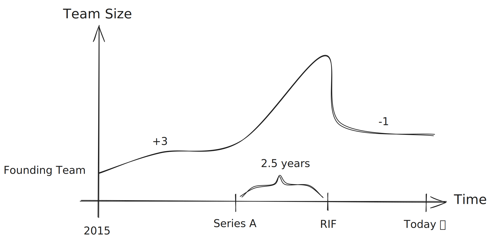

I’ve been asked to scale my engineering group twice its current size over the next 12 months.
The last time we tried that, a group leader was brought in from the outside, and I moved into a team lead role to support the process.
A lot has happened since then, and I’ve been reflecting on what we did wrong—and how we can do better this time.

Above is a graph of the team’s size. At its peak, we were about 25–30 people in engineering.
After the RIF, we were 15—including product, QA, and our project manager.

After the initial aftershock of the RIF, the team was actually very happy. Only one person left after the RIF—and that was to become a founding team member of another startup.

## Communicate the Costs of Growth

Last time we scaled, we had a strong founding team—many of whom are still here. Besides me, two other core team members transitioned from individual contributor roles to management, making it three out of four.

At that point, our senior engineers had a lot of context, history, and shared trust.
A single sentence between two founding members could close a technical design without saying another word.

The expected outcome should’ve been obvious: three of our best ICs were taking on management responsibilities. That *should* have meant less "hands-on" time and more overhead. Right?

Well, that wasn’t clearly communicated. So we tried to do everything—keep our productivity high, stay hands-on, and support onboarding teams.

That didn’t work. Instead of delegating ownership to new team members, we found ourselves taking on even more—specifically, ownership of production issues caused by their bugs.

**Lesson learned**: If you're changing roles, scaling the team, or asking someone else to scale theirs, be painfully clear about what that means.
Yes, team leads will be less hands-on. Yes, productivity might dip for a while. But that’s the cost of growth—and it’s worth it.

## Hire for Culture

We had a technical interview process that I loved—and many candidates did too.
But when it came time for the culture-fit step, we left that to the group leader.

I’m still not sure what kind of culture he had in mind, or where his red lines were. But I don’t blame him. We didn’t define or communicate our culture well enough. 

Only after the RIF did we put our values and culture into writing—so we could all align on them. This is how we expect engineers to behave: take ownership of epics, raise flags when something feels off, collaborate effectively, and make the most of their working hours. Today, I feel confident communicating these expectations to candidates. If they feel uncomfortable with it, that’s a clear signal this environment isn’t the right fit for them.

If I were hiring today, I’d prioritize culture fit over technical perfection.
I want high-potential engineers who are eager to learn and grow—even if they’re more junior—because then, culture is easier to shape.

## Let People In — In Every Way

Recruiting people is just one part of the process. Letting them *in* is the hard part.

We have to invest emotionally in new hires. That means giving them every piece of information they need to succeed—through feedback, 1:1s, pair sessions, and more.

While we *did* run 1:1s, I recall avoiding harsh feedback with new joiners. We had an onboarding program with recorded sessions, and most new hires were impressed with how organized things were compared to their past companies.
But it wasn’t very interactive. Today I understand that investing in *team dynamics* is a crucial part of onboarding.

### Care Personally, Challenge Directly

Avoiding harsh feedback is what [*Radical Candor*](https://www.radicalcandor.com) calls **Ruinous Empathy**—being overly careful not to hurt someone’s feelings in the short term, which actually ends up hurting them in the long run.

*Radical Candor* is a leadership framework that helps you give feedback by combining two things: caring personally and challenging directly.
It’s about being honest without being a jerk—giving tough feedback while actually caring.

I joined the startup as an equal to my team members. Yes, I was the VP of R&D, and yes, I cared deeply about my peers—but I didn’t feel the need to challenge them because they performed well, they gave their best and they grew, it was a perfect team. When I later stepped down to be a Team Leader, I didn’t make the mental shift: that now I did need to challenge people, what's right for four developers isn't right for ten developers. The people I was managing weren’t made of the same stuff as the founding team. I think it was only in my second role as a Team Leader that I truly understood what it means to Care Personally and Challenge Directly. During that period, I realized these were people I needed to grow, to challenge, and to care for.

And that brings me to what I believe is the key to successful onboarding: **feedback**.

# Feedback to the Rescue

Feedback is our tool—as leaders and peers—to help people grow so we can work better together.

I find it especially useful for shaping culture, but it applies across the board.  
For feedback to work, it must be consistent—especially in 1:1s.

There’s already a lot written online about [how to give effective feedback](https://www.cultureamp.com/blog/how-to-give-effective-feedback), so I won’t repeat it all here. Instead, here are a few lessons I learned the hard way.

**Don’t avoid feedback**, If we wait too long, the other person only finds out when it’s already too late—when trust has quietly cracked, and one or both of us no longer believes the relationship can work.  
At that point, it’s not just hard to fix—it might already be over.

**Tip**: Feedback should always come from goodwill—because you want your teammate to succeed.  
Here’s something I often say:

> I’m giving you this feedback because I *care* about you and want you on my team. I believe in your ability to make a positive impact.

If you truly believe that, you’re halfway to giving great feedback.

**Another tip**: Many managers try to [**“shit sandwich”**](https://www.radicalcandor.com/blog/feedback-sandwich-praise-criticism) their feedback (criticism sandwiched between two compliments) to avoid hurt feelings. **Don’t do this.**
Actually, avoid mixing good and bad feedback in the same session. People often only remember the positives.

Feedback isn’t about protecting feelings—it’s about aligning people with the organization’s expectations. Once expectations are clear, and you coach and support them, performance improves.

## A Real Story: Belief, Feedback, and Growth

Recently, a new team member joined us from another team in the company. We knew she could have been more impactful in a different team, so we moved her from a legacy-feature team to a greenfield one.

It was a big, sudden change, one that happened *to* her. I thought to myself: that must have been a jarring experience.

For starters, there was a cultural difference between the two teams. In her former team, people tended to receive features and work on them end to end, mostly consulting with the team leader. In her new team, members take ownership of epics, while collaborating with other team members, the tech lead, product, and me.

Because of those two reasons, the transition wasn’t exactly smooth. I sensed she was more focused on proving her independence instead of focusing on collaborating with the team. The team dynamics here were very different from what she was used to. I (decided to...) gave her this feedback:

> You’re part of a *team* now—act like a team member.  
> In this team, we rely on each other. We consult, brainstorm, and support one another.  
> Use that to your advantage.

A few weeks later, I noticed an improvement in the dynamics between her and the team. Now, seeing how she connects with the team, I’m honestly happy with it.

Once we’d built enough trust, she asked me in a 1:1 how I could help her grow. I told her that, technically, she had what it takes to be a Senior Engineer. But that’s not all it takes. It’s more of a mindset—being data-driven, a bug fixer, professional, opinionated, an owner, a mentor, resilient, collaborative, and innovative.

By telling her to act like a Senior Engineer, I passed the ball to her. It was up to her to take initiative — to ask for feedback from others, to speak up, to lead. Of course, we kept the conversation going in future 1:1s.

At that point, I didn’t fully see her as a Senior Engineer yet — but I believed she could grow into it. What she needed was to stop being passive and start being proactive.

> I believe in you. You’re here for a reason — whether it’s to grow personally, help Upsolver succeed, or both.
> I’m here to support you. And most of the time, those two goals go hand in hand.

To back up my words, I gave her full ownership of a new service. It was tough at first, but she grew into it.

Now she’s proactive, communicative, and collaborative. I believe most of that growth came from a combination of **feedback and belief**.

One piece of feedback she gave me was that it’s clear I genuinely care about my team—and that I show it through my actions. 🥰 That meant a lot to me.

I also wanted to share her own words about feedback and the journey she’s had here so far:

> Feedback’s a peculiar tool. When it’s vague, poorly timed, or comes from the wrong place, it’s worse than useless. It can actually set you back. But when it’s direct, kind, and focused on what really matters, it becomes something else entirely: a way to shift lanes, to see the road from a new angle.
>
> What I appreciated most in your feedback wasn’t just the honesty, but how it felt like an invitation to align our perspectives, not a judgment on my worth. It’s rare to get feedback that makes you think, “Oh, I see what you’re seeing now”, and even rarer when it comes with a genuine belief that you can rise to meet that vision.
>
> The best feedback doesn’t just tell you where you are - it shows you where you could be, and makes you want to get there.

## Receiving Feedback

Whether it’s from a direct report, peer, or manager—receiving feedback well is critical.

1. **Listen carefully** — Even if the feedback is poorly delivered, listen closely.  
2. **Don’t react immediately** — I’ve had hour-long sessions where I just listened to employees vent, took notes, and let them get everything out. Later, I’d follow up with action items and ask what they thought. This gave them a sense of ownership and helped build a [*growth mindset*](https://online.hbs.edu/blog/post/growth-mindset-vs-fixed-mindset). 
    * As a direct report, I would even wait
further before jumping into conclusions.

One of my direct reports, after becoming a manager himself, once said:

> One of the best things I learned from you is how to listen carefully and not shoot from the hip—putting up with me venting for hours.

## How to Receive Feedback as a Manager

It’s often hard for employees to give feedback to their managers. That’s why managers should regularly ask for it — directly when possible, and indirectly when needed.
If direct requests don’t work, try this:

> For our next 1:1, I’d like you to think of two ways our team or group can improve.

This lowers the emotional stakes and helps avoid **Ruinous Empathy**.
When you get feedback, take it seriously, listen carefully, and clarify if needed.

## Cultivating a Feedback Culture

As a leader, always ask for feedback—first directly, then indirectly if needed.

Once trust is built, people will come to you with feedback—about you, your team, or their peers.  
Encourage **peer feedback**, too, not because you don’t want to be a “kindergarten teacher,” but because this builds a stronger team.

I often refuse to pass peer feedback on behalf of someone else and instead push them to deliver it directly. I believe that builds leadership skills, and helps them grow.

They usually respond like this:

> I feel much better after talking to them directly—thanks for pushing me to do it.

An employee who also came with her A-game to 1:1s suddnedly snapped at me and then immediately apologized. She was frustrated about her something, I don't even remember what was it, but the point was she very hesitent to be fully honest with me. My reaction to her surprised her:

> You don’t need to apologize. I’ve been waiting for this moment for so long, and I’m glad it finally happened. I’m genuinely thankful for your feedback. You can feel free to give me feedback any time.

That moment was important to me, it showed her that I was open to receive feedback without getting defensive. And that’s exactly the kind of culture I want to build: one where people feel safe to speak up, where feedback flows in every direction — not just from managers, but between peers as well.

## _People_ vs _Ideas_

When fostering a feedback culture as a leader, you should always steer the conversation from _people_ to _ideas_. Feedback about ideas and behaviors should always be welcomed. Feedback about people, on the other hand, can create a toxic environment. Make sure to uncover the underlying issue in the feedback, which is usually not the person themselves, but the culture, process, tools, or environment. Once you identify it, reframe the feedback so it focuses on the actual issue.

For example, in one of our retrospectives, a front-end developer complained about "The Architect of the Front End." This person must approve every PR before it’s merged into main, which creates a bottleneck—especially if they’re on vacation 🏝️. He’s smart, and I appreciate his ability to remember every block of code to encourage reusing more and writing less. I reframed this feedback to focus on the process: reviews aimed at promoting code reuse can happen afterward; they shouldn’t block merging to production, especially for long periods.

## We’re Growing Again — This Time, Wiser

I’m excited to start this journey again—this time more thoughtfully and carefully.

I promise to fight personally for every member of my group — by giving feedback, building trust, and making sure that happens for everyone.

---

If you want to dive deeper into feedback and how to make it work for your team, these are great resources:

- **[Thanks for the Feedback](https://www.amazon.com/Thanks-Feedback-Science-Accepting-Challenging/dp/0670014664)** by Douglas Stone & Sheila Heen
- **Radical Candor**
  - **[The Book](https://www.radicalcandor.com/book/)** by Kim Scott
  - **[The Podcast](https://www.radicalcandor.com/podcast/)** hosted by Kim Scott and Russ Laraway
