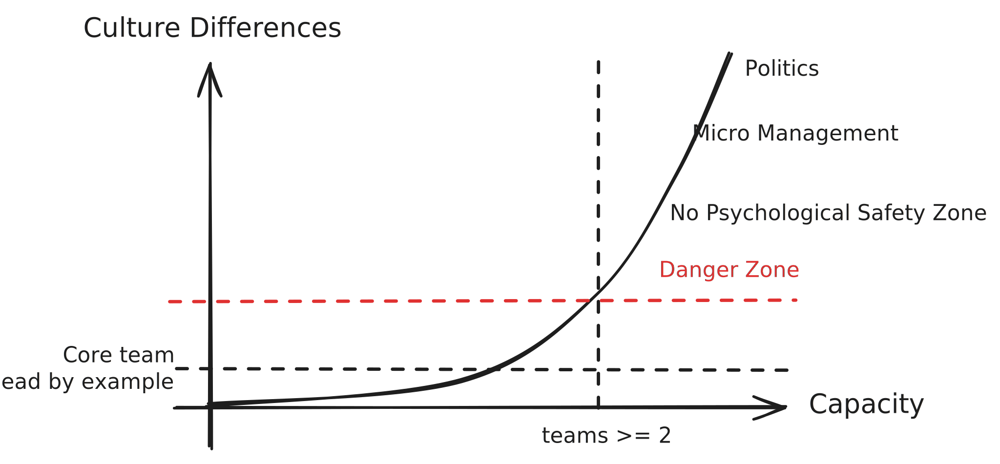

## 🧬 Why Culture Matters?

Ten years ago, Upsolver was founded with a mission: to shift Data Lake development left and make it easier to build data pipelines. Back then, tools like Airflow and Spark (still in beta at the time) were primarily used by data engineers, which created a bottleneck in how organizations could leverage their data.

Because our mission was core to the operational success of data-driven companies—where downtime, bugs, or production issues are critical—the founders made a deliberate choice: to hire a deeply senior, self-driven engineering team.

I suspect many startups begin this way, with engineers who needed no
management and took full ownership. People who loved to push things forward and
weren’t afraid to raise flags when things went wrong. I loved working in that
culture and with this group of people; it engaged me so much that I was willing
to work for a reduced compensation package, because I was sure that going on this
journey with this group of people would be more satisfying.

As the team grew from the four core engineers (who are still at the company!) to ten engineers, cracks in our culture began to show. It's hard to identify differences in culture in the hiring process, it's one thing to say "I want to step up and have ownership", but when it comes to practice, it's not that easy. Looking back, I hadn’t yet understood that the way we hired, onboarded, and even let people go needed to revolve around culture first—well before technical skills. It took me a while to learn that cultural alignment isn’t just important; it’s foundational. From that point on, it becomes dangerously easy to break the company’s DNA, the way people are expected to
behave and collaborate.

I remember one specific moment. One team teams was racing toward a deadline we'd set
with marketing. At first, everything seemed under control—but as the
date approached, cracks began to show. Bugs started popping up just days before
the launch. Requirements shifted at the last minute. The team working on that
part of the product should’ve raised the alarm much earlier, but they didn’t.
They were stressed, overwhelmed, maybe even afraid to speak up. The mood turned
heavy, tense. And slowly, the
[psychological safety](https://www.youtube.com/watch?v=LhoLuui9gX8) we’d worked
so hard to build started to erode. That’s when it hit me—with frustration—that
this wasn’t the company I had signed up for.

If you're not actively preserving culture, you might end up with teams or
individuals behaving in ways you never imagined:
[micro-management](https://www.reddit.com/r/business/comments/14xk3go/could_you_explain_to_me_what_micromanagement_is/),
lack of psychological safety, politics 🤮—all the stuff we dislike in big
companies and the very reason many of us chose startups in the first place.
Because they align with our DNA, our
[values](https://www.engmanagement.dev/the-value-of-values).

## Where it broke for us — Micro Management

In our early days, we assigned
[epics](https://www.atlassian.com/agile/project-management/epics-stories-themes)
to engineers—launch 🚀 and forget. Engineers were expected to raise flags when
something was off.

I’ve played many roles at Upsolver. I began as VP of R&D, but as the
engineering team expanded and split into multiple teams, I stepped into a team
leader role to better support the scaling process. Later, I moved into an
individual contributor position to dive deeper into the product and technology.
During that phase, I shifted my focus toward execution, trusting that the
broader engineering group was in good hands. Over time, I returned to a team
leadership role and eventually resumed the VP of R&D position.

It was during my time as an individual contributor that I began to notice a
troubling pattern: engineers were being handed small, granular tasks. Instead
of pushing back or asking “why,” they defaulted to passive execution. In
dailies and sprint reviews, the conversations centered on solutions, not
problems. It became clear to me that the value of ownership had faded as the team grew. While I was previously responsible for setting that tone, no one else felt comfortable stepping up to maintain.

That's where I decided to take over a team, and what I found was alarming: the
team was efficient—but robotic. It was
[Cargo Cult Engineering](https://blog.bitgloss.ro/2020/08/cargo-cult-programming/).
They executed flawlessly, but without the curiosity, depth, or ownership that
makes software great.

It felt like we had highly paid senior engineers working more like juniors. No
hard feelings—just reality: all ownership and accountability now lived squarely
in the team leader’s role.

## Rebuilding Ownership

The first thing I did for the team was to start assigning *epics* to engineers as
opposed to tasks before that. I told the team:

> From that point on, it’s up to you whether the epic is a success or failure.
> You're the face of this work.

That shift alone was powerful. Some engineers lit up immediately—asking smart
questions, challenging assumptions, collaborating across functions. That’s what
ownership looks like. We run yearly employee engagement surveys (and
importantly, we act on the results), and the high engagement score increased by
**50 percent**, and employee perceived impact increased by **more than double**.

Some engineers loved it right away, while others needed more time and support,
but we felt it was inevitable to maintain the workplace culture we loved.

### Core Factors in Rebuilding Ownership

If the first step is giving engineers true ownership, the second step is helping
them handle it successfully:

1. **Trust** - trust is the baseline you should start with, you can't assign
   epics without trusting the team members to succeed, this experience is crucial
   to them, epics should match the engineer's level of experience and context.

2. **Stop giving answers—start asking questions** - Engineers might come asking
   for the solution to the problem you just handed them because they're used to
   it, and you're used to giving them solutions. Try to avoid doing that. To
   remind myself, I kept this printout always in front of me:
   

3. **Connect them** - When they come with questions, see if you can lead them to
   product, tech leaders, team mates, and customers.

4. **Discuss in 1:1s** - Talk about their experience leading an epic. Engineers,
   especially those early in their careers or new to the company, may feel
   frustrated if they can’t find time with Product or other functions—and may not
   feel confident giving feedback to them.

5. **Hold status meetings with epic leaders** - Don’t hesitate to ask the hard
   questions:
    - Are we on track?  
    - What should we change in order to stay on track? (Narrow the scope? Shift
      resources?)  
    - Technical Questions on the proposed solution (*Remember, only questions and
      thoughts, no answers*)

### 🚩 Sidenote on overtime

Sometimes engineers take ownership too far—they start working overtime,
assigning themselves extra tasks, trying to carry the whole thing on their back.
That’s a signal. As a leader, your job is to **notice it**—and insist on
_smarter delivery_ over unsustainable effort. If you encourage ownership with
your engineers, especially those new to it, this topic should come up regularly
in 1:1s to ensure balance and well-being.

## A living proof

I remember giving one of my engineers a feature to work on that would make it
easier to onboard by creating wizards that would create pipelines from A to B.
She shined right away, collaborating with Tech Leaders, Product, and Engineers.
The project was a success, and it changed the way she thought about her role
and her workplace.

Looking back, she described the experience like this:

> It was the first time I was given an opportunity like that. This was my second
> job, and I hadn’t yet been responsible for a process that was defined at such
> a high level. In fact, all I received was a Figma design from Product,
> describing the desired user experience and that was it.  
>  
> I had to design the feature, go through several rounds of review with my team,
> team lead, and tech lead. Once the design was finalized, I detailed the tasks,
> assigned them to teammates, tracked progress against deadlines, and was
> involved in almost every code review.  
>  
> This experience showed both me and others that I was capable of owning
> something end to end and that I could be trusted. It felt like I had progressed
> to another stage in my career and opened the door to taking more initiative and
> ownership with future features.

That was one example. That particular engineer was ready to jump into the water
and manage epics, other engineers feared being assigned epics. There's a lot of
coaching to be done with each engineer until you trust them to be on top of
things. For us, **this process became a key signal**—a way to understand whether
an engineer was a good long-term fit for our organization or not.

Later, when people asked me questions about that feature, I had full confidence
in handing those conversations over to her. It helped boost people's trust and
respect for her. **Delegating responsibilities to her was also a test** — if I
didn’t get any pushback, it meant she truly succeeded in owning it and staying
on top of things. After a while, people started coming to her on their own.
She happily works "the epic way" ever after.&nbsp;😃

## Final Thoughts

One of our investors at Upsolver always used to say:

> Give your employees your problems, not your tasks.

Giving engineers real autonomy not only helps you achieve surprisingly better
results but also helps you grow leaders from within. This creates a ripple effect:

- You *scale organically* rather than relying on outside hires or, alternatively,
  achieve more with the same or fewer resources.
- You *reduce churn* by keeping people engaged and satisfied. We had a churn of
  only one engineer in the last two years—and that was because he left to become
  a founding member of a startup.
- You *boost problem-solving* capabilities by empowering engineers to own
  challenges end-to-end, leading to more innovative and effective solutions.
